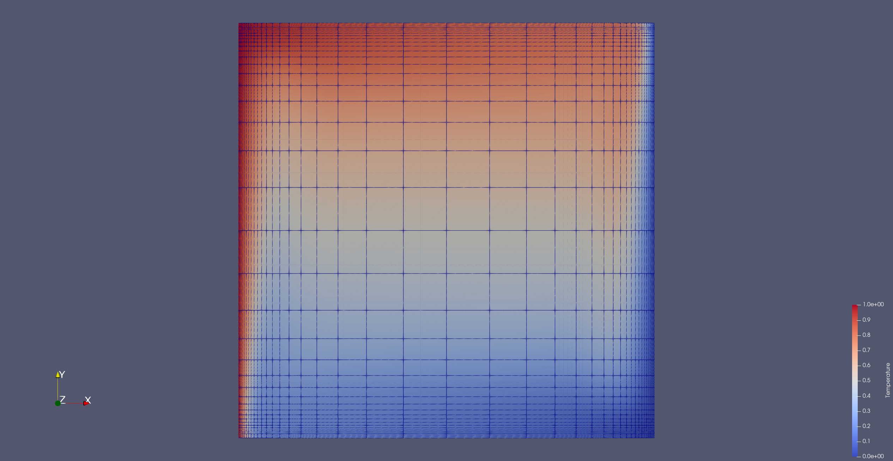

# Convection in Firedrake

This is attempt to evaluate the Nusselt number $Nu$ (is rate of heat transfer by convecting system) as a function of the Rayleigh number $Ra$.

The largest Rayleigh number successfully run thus far is $2 \times 10^6$ using the direct solve and the parameters in the script rayleigh-benard_mod.py.

