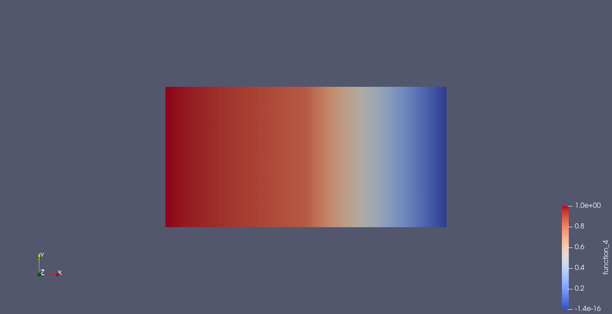

# Heat-transport
Models of heat transport

**Ed_heat_transport_toy.py** - toy model of heat transport given a temperature profile on the left-hand-side of the domain, insulating boundary conditions on the left-hand-side half of the top and bottom, then constant-temperature boundary conditions for the right-hand-side portion of the domain.

The diffusivity tensor is anisotropic on the LHS (with transport only permitted in the horizontal direction, or at 5 degrees to that axis, in the examples illustrated).  Observe, however, how contact with the RHS region "sucks" heat out of the beam, reducing the temperature at the strike point compared to the LHS wall temperature.

 on LHS and isotropic (1,1) on RHS.")

).")

It is easy to create more complicated examples e.g. anisotropy tensor aligned to curved field lines (e.g. change the definition of bhat to bhat = as_vector([1.0, sin(20.0*x)])) to create the following plot.

Some of the basic physics can be shown in a 1D example (Neumann BCs top and bottom) with unit temperature on the left-hand-side boundary and zero on the right.  Then the temperature varies piecewise linearly and the midpoint temperature is k_left / (k_left+k_right) i.e. the fraction of temperature dropped across the plasma depends on the ratio of its conductivity to that of the metal, and the more conductive the plasma the less temperature is dropped across it. Here k_left is 5 times k_right and so the strike-point temperature is 5/6 = 0.833.  Note the heat flux is constant in x as it is the product of k and the gradient (factors which vary reciprocally).

